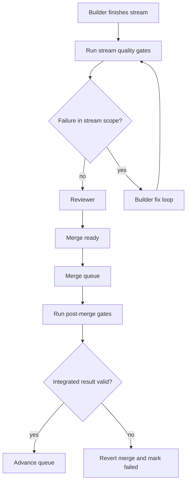

## What Are Quality Gates?

Quality gates are shell commands that run after an agent makes changes. They enforce lint, type checks, tests, and any other deterministic validation you want. Gates are the primary mechanism Tack uses to verify that agent output is correct before it gets merged.

```yaml
quality_gates:
  - "bun test"
  - "bunx tsc --noEmit"
  - "bun run lint"
```

Gates run in order. The first failure stops the chain. The full command output is captured and used for error attribution.

## When Gates Run

Gates run at two points in the pipeline:

1. **After each builder agent finishes** — the `run_quality_gates` deterministic step in the `build-review` blueprint. This checks the stream's work before it moves to review.
2. **After each merge** — post-merge gates run against the integrated result. This catches issues that only appear when streams are combined.



## File Attribution

Quality gates run against the **full project**, but Tack only fails a stream for errors in **its own files**.

How it works:
1. Tack runs the gate command (e.g., `bunx tsc --noEmit`) in the stream's sandbox
2. If the command exits non-zero, Tack parses the output to extract file paths from error messages
3. Tack checks each error file against the stream's file scope
4. Only errors in the stream's scoped files count as failures

```
Stream 1 (backend):  bunx tsc --noEmit → fails on frontend error → PASS (not in scope)
Stream 2 (frontend): bunx tsc --noEmit → fails on frontend error → FAIL (in scope, fix-loop)
```

This means pre-existing errors in other files do not block progress. Cross-file breakage introduced by merging is caught at merge time when post-merge gates run.

### Scope Precision

The file scope is set by the planner when creating the plan. If a stream's scope is too broad, it may be held responsible for pre-existing errors in files it did not change. If the scope is too narrow, it may not be caught for breaking files outside its scope (though post-merge gates catch these).

## Fix Loops

When gates fail for errors in the stream's file scope, Tack triggers a fix loop:

1. The gate output (errors, file names, line numbers) is collected
2. The builder agent is re-spawned with the gate output attached as fix context
3. The agent attempts to fix the issues
4. Gates run again
5. Repeat until gates pass or the iteration limit is reached

The iteration limit is controlled by `max_fix_iterations` in the blueprint:

```yaml
- id: lint
  type: deterministic
  action: run_quality_gates
  retry:
    max_attempts: 2
  on_fail: build
  max_fix_iterations: 3
```

In this example, the builder gets up to 3 chances to fix gate failures. Each iteration counts as one fix-loop cycle.

### What Happens When Fix Loops Exhaust

When `max_fix_iterations` is reached, the recovery system takes over. The failure is recorded in the recovery ledger and the retry profile determines what happens next:

- If retries remain, the whole step may be retried
- If retries are exhausted, the run blocks for human guidance

See [Recovery & Retries](/docs/concepts/recovery) for the full recovery model.

## Post-Merge Gates

After streams are merged into the base branch, quality gates run again against the combined result. This catches integration issues:

- Two streams that individually pass gates but break when combined
- A stream that modifies an interface that another stream depends on
- Import path changes that only fail when all files are present together

If post-merge gates fail:
1. The merge is reverted (`git reset --hard HEAD~1`)
2. The stream is marked as failed
3. The gate output is stored in the merge entry for debugging

You can view post-merge gate failures:

```bash
tack merge                    # See which merges failed
tack watch --verbose          # See gate output in the event stream
```

## Writing Effective Gates

Good quality gates are:
- **Fast** — they run after every agent step, so slow gates slow down the whole pipeline
- **Deterministic** — the same code should produce the same result every time
- **Specific** — error messages that include file paths and line numbers help Tack attribute errors correctly

Common gate commands:

| Purpose | Example |
|---------|---------|
| Type checking | `bunx tsc --noEmit` |
| Linting | `bun run lint`, `golangci-lint run` |
| Tests | `bun test`, `go test ./...` |
| Build check | `go build ./...` |
| Custom validation | `node scripts/check-exports.ts` |

You can also use gates for project-specific checks — anything that returns exit code 0 for success and non-zero for failure works.
